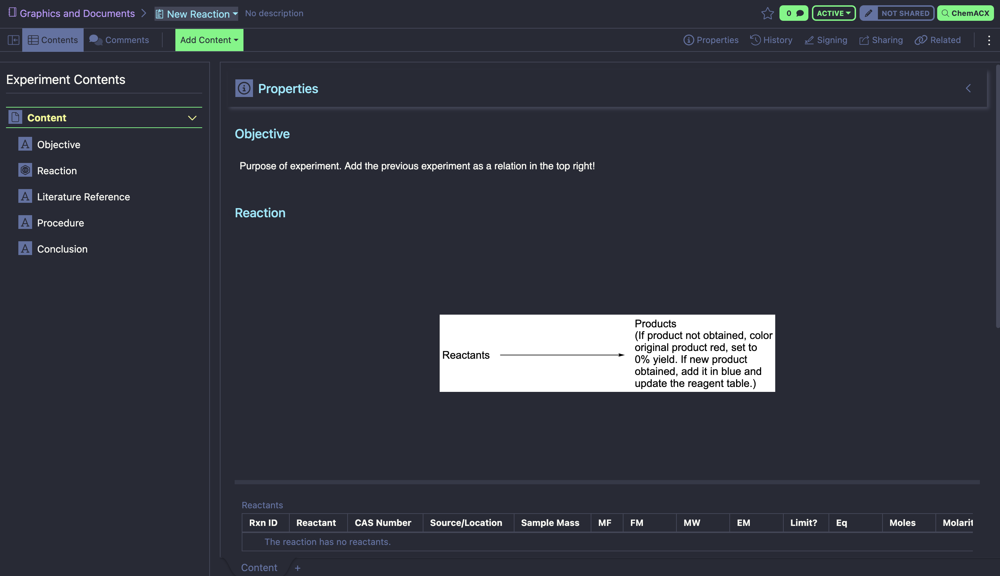

# Signals Notebook Dracula Theme

## Installation

**Easy Installation:**

1. Install the Stylus extension ([Chrome](https://chromewebstore.google.com/detail/stylus/clngdbkpkpeebahjckkjfobafhncgmne)) ([Firefox](https://addons.mozilla.org/en-US/firefox/addon/styl-us/)). This extension allows you to add custom styling (CSS) onto webpages like Signals Notebook.
2. Open the extension and go to `Manage` > `Get and share styles` (bottom left), which should take you to the website `userstyles.world`.
3. Search "Signals Notebook" and look for the entry "Signals Notebook Dracula Theme by IsoPhoenix"
4. Install the theme. You can disable/reenable it any time through the Stylus extension! Just go to `Manage` > `Signals Notebook` and check/uncheck the `Enabled` box and hit `Save`.

**Manual Installation:**

You can also create a new style in the Stylus extension, then paste in the CSS code from the `signals-dracula.css` file in this GitHub repository. Set the style to target URLs starting with `ucberkeleysite.signalsresearch2.revvitycloud.com/elements/`.

## Troubleshooting

This theme is experimental so there are likely small bugs here and there. If you have problems with the way something looks or have suggestions feel free to shoot me an email matthew.su.2019@gmail.com
